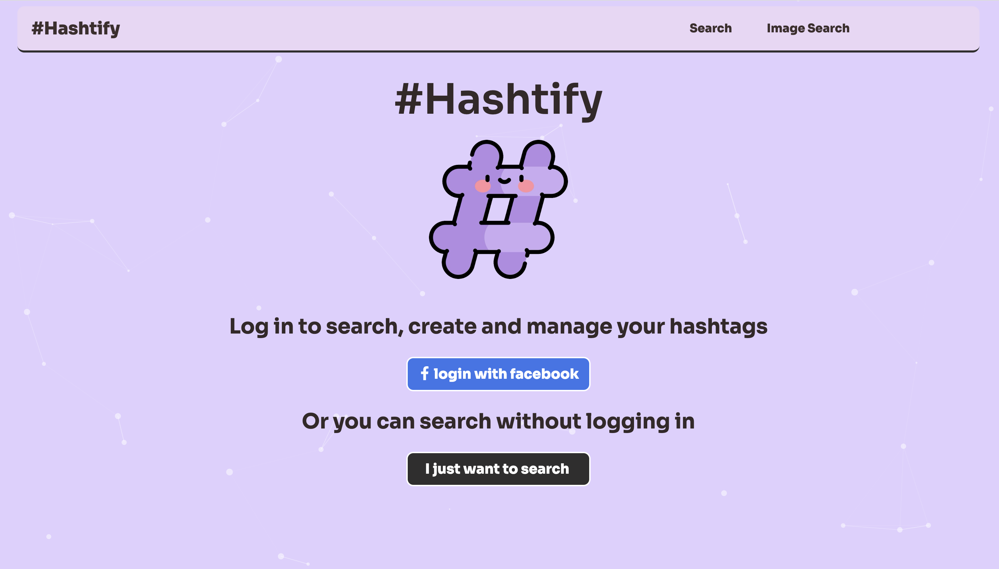

# Hashtify - Search, Create and Manage Hashtags

 ## A React based web app created by [Yan](https://github.com/yan-fung) and [George](https://github.com/George-xixi).


## Hashtify takes the hassle out of hashtags!
 
### Main features
 - Search for hashtags
 - Copy them to your clipboard 
 - Log in with facebook
 - Save to your user
 - Create new hashtags
 - Organise by category

## Landing Page



## APIs Used
 
 - [Hashtify Backend API](https://github.com/yan-fung/backend-hashtag-generator) by [Yan](https://www.commandshift.co/)
 - [RiteTagAPI](https://ritekit.com/) by RiteKit
 
 ## Packages

- [React Icons](https://react-icons.github.io/react-icons/)
- [Axios](https://www.npmjs.com/package/axios)
- [Facebook Login](https://github.com/keppelen/react-facebook-login)
- [TS Particles](https://particles.js.org/)
- [Copy to clipboard](https://www.npmjs.com/package/react-copy-to-clipboard)
- [js-cookie](https://www.npmjs.com/package/js-cookie)
- [jwt-decode](https://www.npmjs.com/package/jwt-decode)
- [React Router](https://reactrouter.com/en/main)

## To work on the code yourself:
---
### 1. Create a [Meta Developer](https://developers.facebook.com/) account
- You'll need this to use the facebook login component
- Which you'll use to get an appID number
- In src/components/Login.js - line 22 - add your appID here
 
### 2. Get the [Hashtify Backend API](https://github.com/yan-fung/backend-hashtag-generator)
- You'll need [docker](https://www.docker.com/) to run this API.

### 3. Clone this repo
```bash
git clone https://github.com/George-xixi/hashtify
```
### 4. Install dependencies
```bash
npm i
```

### 5. To run tests 
```bash
npm test
```
### 6. To run locally 
```bash
npm start
```

---
## Common Issues
### - Can't install packages?
The Facebook Login component can prevent new packages from being downloaded, you may need to try:
```bash
npm i --force
```

### - Can't log in / log out 
 - Facebook for developers has a limit - maybe slow down!
 - Double check you have HTTPS=true in your start s
---

## If we had more time
I would love to:
- Make the app responsive for mobile sized devices
- Add an edit hashtag button
- Add other log in methods
---
## Thanks

-Thanks to [FlatIcon & Freepik](https://https://www.flaticon.com/free-icons/hashtag) for the Hashtify Logo!

-Thanks to all the tutors at [Command Shift](https://www.commandshift.co/)!

### George - 2023
